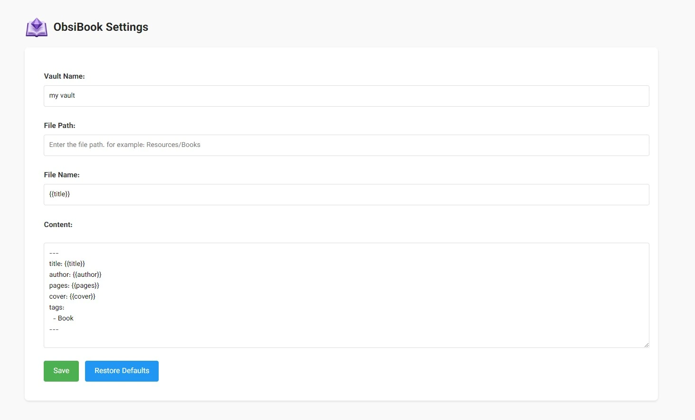
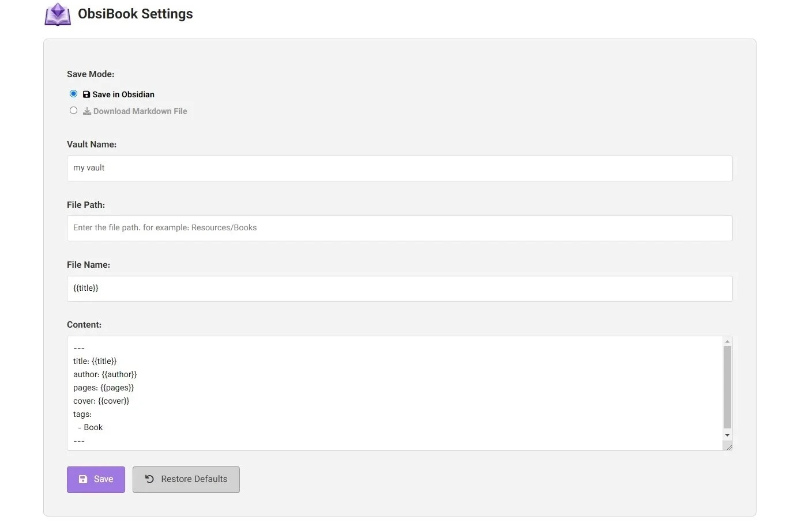

# ObsiBook

افزونه ObsiBook یک اکستنشن گوگل کروم است که اطلاعات مربوط به کتاب را از سایت‌های مشخص استخراج کرده و در قالب یک فایل مارکدان ارائه می‌دهد. اطلاعاتی مثل: عنوان کتاب، نام نویسنده، تعداد صفحات و تصویر کتاب.

این افزونه در اصل برای [نرم‌افزار obsidian](https://obsidian.md) طراحی شده و مستقیما فایل خروجی را در این نرم‌افزار ذخیره می‌کند. البته با تغییر حالت save mode در تنظیمات افزونه میتوانید فایل مارکدان را به تنهایی دانلود کنید.

  
این افزونه در حال حاضر از سایت های زیر پشتیبانی می‌کند:
- [گودریدز](https://www.goodreads.com/)
- [طاقچه](https://taaghche.com/)
- [فیدیبو](https://fidibo.com/)
- [دیجی کالا](https://www.digikala.com/)

 

## راهنمای استفاده

<a href="https://www.aparat.com/v/zbg2jw5">مشاهده ویدئو در آپارات</a>

### گام اول: دانلود و فعال سازی

- برای دانلود از بخش code روی Download ZIP کلیک کنید.
- فایل ZIP را از حالت فشرده خارج کنید.
- در گوگل کروم از بخش تنظیمات Manage Extensions را باز کنید.
- حالت Developer mode را فعال کنید.
- روی Load unpacked کلیک کنید.
- فولدر افزونه را سلکت کنید.
- حالا افزونه فعال شده و میتوانید از آن استفاده کنید.

### گام دوم: تنظیمات افزونه

قبل از استفاده از افزونه لازم است تنظیمات زیر را انجام دهید:
- روی آیکون افزونه راست کلیک کرده و Options را انتخاب کنید.
- ابتدا حالت ذخیره سازی را انتخاب کنید. حالت «Save in Obsidain» مستقیما فایل را در نرم افزار ابسیدین ذخیره میکند. حالت «Download Markdown File» فقط فایل مارکدان را دانلود می کند.
- در فیلد Vault Name نام والت خود را وارد کنید.
- در فیلد File Path مسیر فایل جدید را مشخص کنید. اگر خالی باشد به صورت پیشفرض در همان صفحه اصلی والت ساخته می‌شود.
- در فیلد File Name می توانید نام فایل را مشخص کنید. برای اینکار میتوانید از پارامترهای متغیر مثل عنوان کتاب یا نام نویسنده استفاده کنید. (در بخش Parameters Guideراهنمای کامل پاراپترها قابل مشاهده است)
- در فیلد Content می‌توانید محتوای فایل را مشخص کنید. مواردی که بین سه خط تیره(---) هستند به عنوان properties شناخته می شوند.
- در نهایت روی Save کلیک کنید تا تنظیمات ذخیره شود. 
- در صورت نیاز با کلیک روی Restore Defaults هم میتوانید تنظیمات پیش‌فرض را فراخوانی کنید.

### گام سوم: راه اندازی
یک صفحه کتاب را از سایت های بالا انتخاب کنید.

روی آیکون افزونه () کلیک کنید تا فایل نهایی را دریافت کنید

 

## منابع
کدهای این افزونه با ChatGPT و DeepSeek نوشته شده است.

  

---
اگر به مطالب مرتبط با نرم‌افزار ابسیدین علاقه دارید می توانید به [وبلاگ](https://ifard.ir/) یا کانال [تلگرامم](https://t.me/ifard_ir/) مراجعه کنید.
